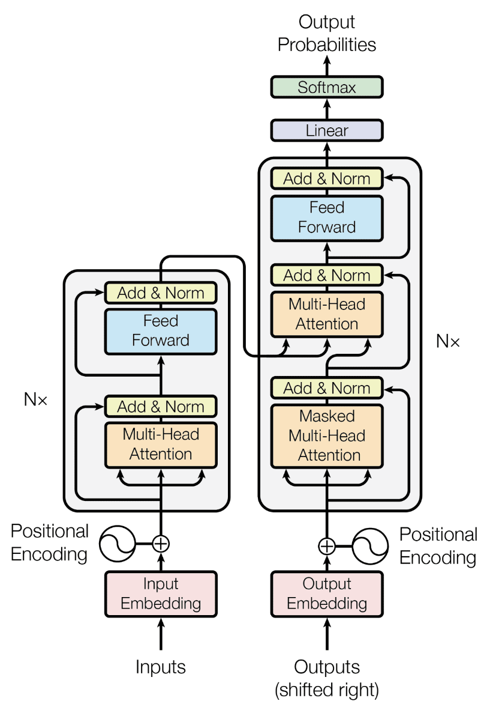
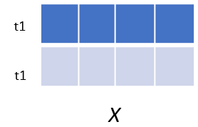
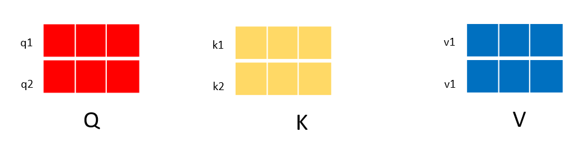
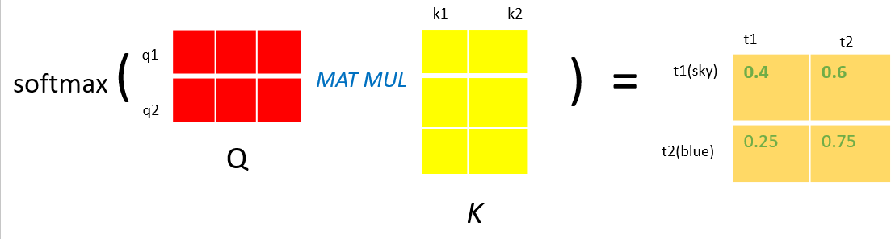
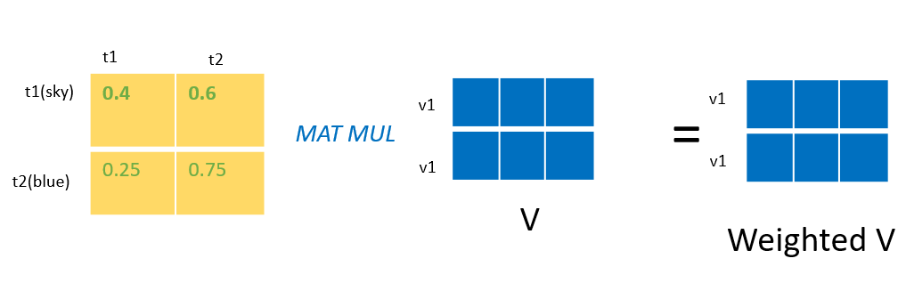
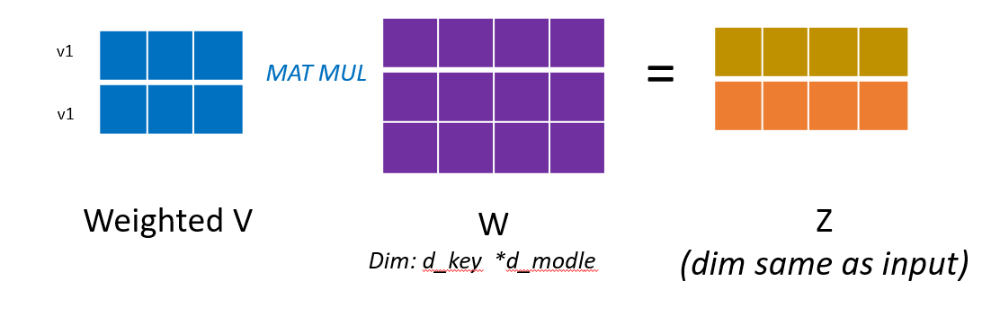
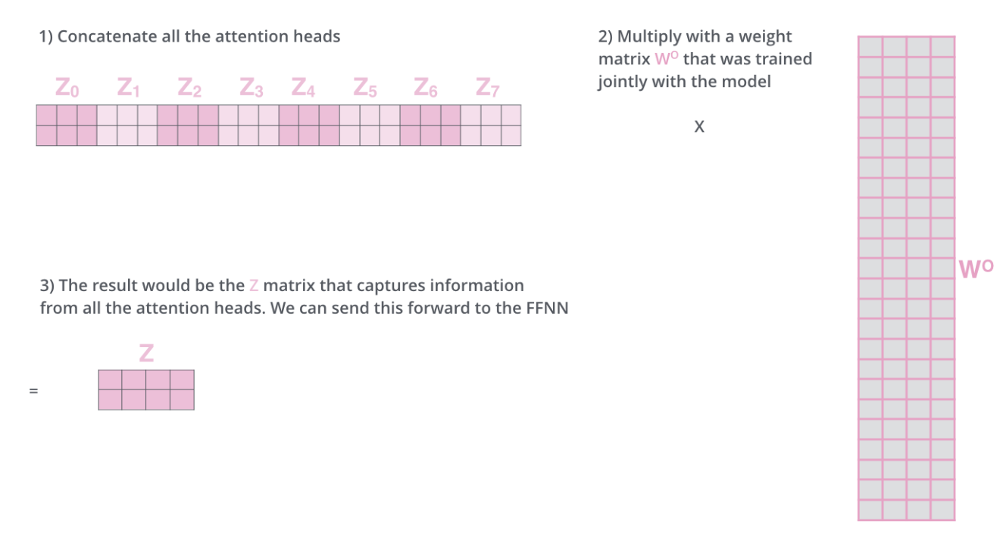
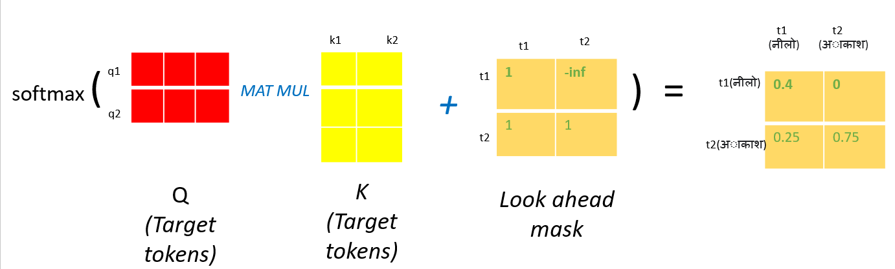

# How to Train Your Transformer from Scratch for Machine Learning Translation

In this blog, I will use the **BERT** architecture to perform translation from *Portuguese* to *English*. This blog provides a *comprehensive* guide to the entire training pipeline, encompassing *Data Preprocessing, Building the Model, Training the BERT Model, and Exporting the Trained Model.* The best aspect of this blog is that I have ensured to elucidate each code section thoroughly.

## A Brief Overview of the Transformer Architecture
*Transformer* has emerged as a prominent subject of research in the realm of AI, particularly in *NLP*, since its introduction in the groundbreaking paper titled *Attention is All You Need*.

    
     
    Transformer Architecture.

One crucial component of the transformer is the **Multi-Head Attention** mechanism. Let's take a moment to understand its theoretical aspects.

### Multi-Head Attention(*MHA*):
Before diving into ""Multi-Head Attention" it is crucial to understand the meaning of *Attention.* In NLP or in ML in general, attention mechanism simply means how a given token is relevant or associated with other tokens. Lets us understand with an example: 
> *Ram is an university student. He loves programming.*

Naturally, when we either read or listen to the above sentence our human mind is capable to understand that "He" is "Ram". Our mind in a way compute attention in order to associate how other tokens(including "He") is relevant to "He".  ***But how does attention mechanism solve this in the transformer?***

Now, let us understand how does Transformer calculate the attention score for each of these tokens.  In the above sentence for each of the tokens *MHA* generates three trainable vectors known as "query(*q*),key(*k*),and key(*k*)". 

> What exactly are query, key, and values ? 

In the above example, the question was how does attention mechanism finds a way to associate "He" with rest of the other tokens. Since, here the token "He" is considered to be a query information and all of the other tokens, including Query token, containing the whole informations is known as contectual information. "He" is called query token because it is looking to find relevancy from the whole context. And, "key" and "value" vectors are contextual information. But, if the both "key" and "value" represents contextual information, do they have same functions in the attention mechanism in *MHA* layer in the transformr. The "key" vectors and "query" vectors are used to calculate the attention weights(0 to 1). Then these attention weights are multiplied to the original contextual information, value vector, where we can get the association of each of the tokens with respect to other tokens. We will discuss the maths behind this in more details in later parts of this blog. 

<!-- In transformer *k* and *v* represents contextual information and *q* represents query information. Let us come back to above question, how does a transformer associates the first token "Ram" with "he" in our above example ? In the first step attention mechanism looks how the first token is relevant to  each of the  other tokens. Here, we call the first token "Ram" as the query token where it is trying to find the relevance from the whole context. And the tokens which represents the whole context information represents the "*k*" and "*v*" vectors. So, the query token("Ram") will look into keys vectors of each of the tokens(inc "Ram") to calculate the attention weight. *In order to calculate the attention weight the query vector is dot producted-ed with all key vectos(including Query itself). Then the dot-preducted result is softmax-ed to obtain attention weight ranging from 0 to 1*.  -->

## Maths behind *MHA*

**ENCODER- PART**

We will start first by understanding self-attention used in transformer encoder. When both contextual and query information comes from same source then this is known as self-attention.

In order to not make this section complex, we will take a simple sentence consisting of two words: 
> Source Input: Blue(t1) sky(t2)

1. **In the first step**, the input tokens are embedded and added positional information. In the transformer, we often use the jargon word `d_model` to represent the embedding dimension. After this process, our input will have a shape of *num_tokens × d_model* or *2 × d_model*. For now, we will represent this embedded input with **X**.  `X` is represented below. 

2. **In the second step**, using input **X**, the *MHA* layer generates three vectors: **q**, **k**, and **v** by multiplying input **X** with trainable matrices **WQ**, **WV**, **WK**, respectively. An important thing to notice here is that the dimension of **q** and **k** should be the same. Here, in this example, we will assume that each of these vectors has a dimension of *num_tokens × d_k*, where "d_k" is the dimension of each token in these vectors.  This step is illustrated below: 

3. **In the third step**, we calculate the dot product of each query vector with all key vectors. The dot-product matrix will have a shape of *num_tokens × num_tokens*. Then, the dot-product is softmax-ed, resulting in a probability distribution. This probability distribution provides the ***attention weight*** of how each token is relevant to others in the range of 0 to 1. 

4. **Fourth**, we multiply the ***attention weight*** with **v** vectors. The value vector consists of contextual information, and thus multiplying it with ***attention weight*** gives the relevancy of each token with other tokens within the context. The resulting weighted matrix dimension will be of *num_tokens × d_key.*

5. **The steps from 1 to 4 output the result from the attention head**. Let us call this output as **z1**. In a transformer, we can repeat the process from step 1 to step 4 for multiple attention heads. Suppose, if we have four attention heads, then we will have four outputs: **Z1**, **Z2**, **Z3**, **Z4**. After this, all the attention heads are concatenated and multiplied with a trainable weight matrix **W**, such that the output results in the same dimension as the input. The last images is taken from [illustrated transformer](https://jalammar.github.io/illustrated-transformer/).

**DECODER - PART**

<!-- Now, we have undertsand about *Multi Head Self-Attention*, it is time to understand "*Multi head Cross-Attention.*", or, "*MCA*". In transformer architecture, we use cross-attention with the decoder part. In BERT, using source language input, *MCA* generates *K* and *V* vectors and generates *Q* vectors from the taget input language. 

Beside how *Q*, *K*, and *V* vectors are produced the math behind cross-attention is similar to as self-attention, except that of step 3. The dot-ed product is added to look- ahead mask such that the query tokens cant look into calculate attention to future tokens. This step can be shown from below figure.

In the above figure we can see target t1 can't  calculate attanetion to future tokens(t2) from the targeted language. This makes sure that there is no cheating involved during the training process. 

***Here, in this document i explained the concepts behind the attention mechanism, inlcuding the mathematics behind this. Don't worry we have explain other part in a clear way in Bert.ipynb notebook([Here](BERT.ipynb)). There we have build transformer from scratch using tensorflow framework. I have also explained each of the code section.*** -->

